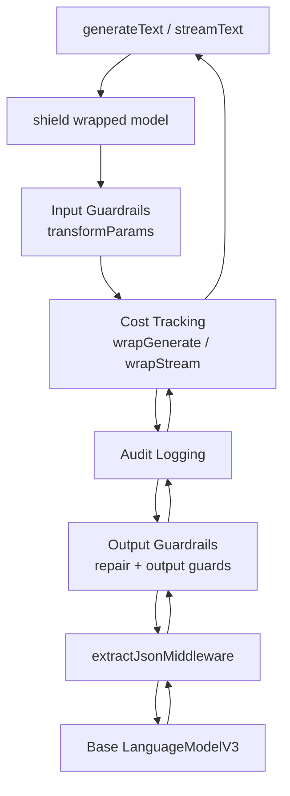

# Architecture Overview

ai-shield is a **library middleware layer** for the Vercel AI SDK. It does not run as a standalone server. You wrap a `LanguageModelV3` once and pass per-request options via `providerOptions.aiShield`.

## Core entry point

`shield(model, config?)` in `src/shield.ts`:

1. Resolves configuration via `resolveConfig()` (see [Configuration](./configuration.md))
2. Creates a shared `ShieldRuntime` with config, session store, and audit emitter
3. Chains five custom middleware layers plus AI SDK's `extractJsonMiddleware`
4. Returns a wrapped model compatible with `generateText`, `streamText`, and related AI SDK APIs

```ts
const middleware = [
  createInputGuardrailMiddleware(runtime),
  createCostTrackingMiddleware(runtime),
  createAuditLoggingMiddleware(runtime),
  createOutputGuardrailMiddleware(runtime),
  extractJsonMiddleware(),
];

return wrapLanguageModel({ model, middleware });
```

## ShieldRuntime

Every middleware shares a `ShieldRuntime` object:

| Field          | Purpose                                                |
| -------------- | ------------------------------------------------------ |
| `config`       | Fully resolved `ResolvedShieldConfig`                  |
| `sessionStore` | In-memory `Map<string, SessionState>` for cost budgets |
| `emitAudit`    | Function that writes to console and/or custom sink     |

## Middleware chain



### Middleware responsibilities

| Layer             | AI SDK hook                  | When it runs                | What it does                                           |
| ----------------- | ---------------------------- | --------------------------- | ------------------------------------------------------ |
| Input guardrails  | `transformParams`            | Before model call           | Injection, PII, keyword checks on prompt               |
| Cost tracking     | `wrapGenerate`, `wrapStream` | Before and after model call | Pre-call budget check; post-call usage recording       |
| Audit logging     | `wrapGenerate`, `wrapStream` | Around model call           | `request.start`, `request.complete`, `request.blocked` |
| Output guardrails | `wrapGenerate`, `wrapStream` | After model call            | JSON/schema repair loop; output PII/keyword guards     |
| extractJson       | AI SDK built-in              | After generation            | Strips JSON from markdown fences                       |

Middleware order matters: input guards run first (via `transformParams`), cost and audit wrap the inner call, and output guardrails (including repair) process the model response before it returns to the caller.

## Public API surface

Exports from `src/index.ts`:

| Category | Symbols                                                                                             |
| -------- | --------------------------------------------------------------------------------------------------- |
| Core     | `shield`, `shieldGenerateText`, `shieldStreamText`                                                  |
| Tools    | `guardTools`                                                                                        |
| Config   | `resolveConfig`                                                                                     |
| Session  | `createShieldContext`, `createRequestContext`, `getOrCreateSession`, `resetSession`, `sessionStore` |
| Errors   | `ShieldBlockedError`, `ShieldBudgetError`, `ShieldRepairError`, `ShieldToolError`                   |
| Types    | `ShieldConfig`, `AuditLog`, `SessionState`, etc.                                                    |

See [API reference](../api/reference.md) for full details.

## Tool guards (separate from model middleware)

`guardTools()` wraps individual tool `execute()` functions with allow/deny policies, call limits, and approval gates. It does not use the model middleware chain but shares audit correlation via `requestId` and `sessionId`.

See [Tool guards](../features/tool-guards.md).

## Mental model

```
Your app
  └── AI SDK (generateText / streamText)
        └── shield(model)  ← middleware chain
              └── base model (OpenAI / Ollama / …)
        └── guardTools(tools)  ← optional, parallel layer
```

## Related docs

- [Request lifecycle](./request-lifecycle.md) — generate vs stream vs repair paths
- [Configuration](./configuration.md) — presets, merge order, per-request options
- [Why middleware](../design/why-middleware.md) — design rationale
