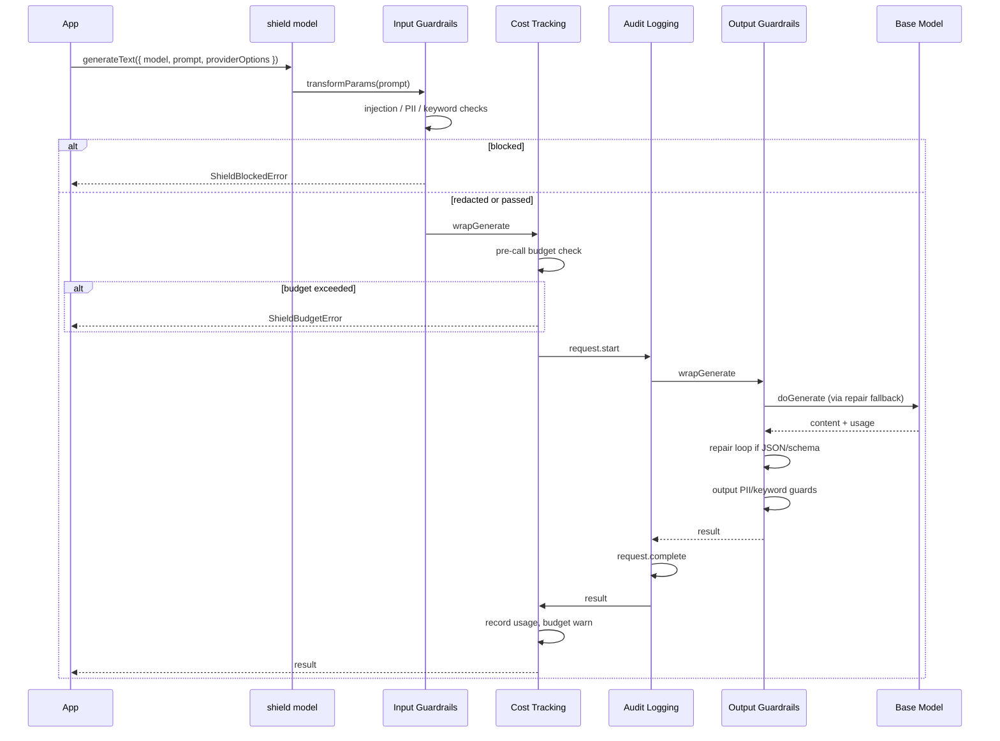
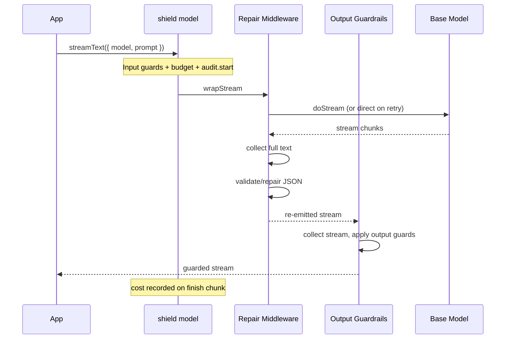
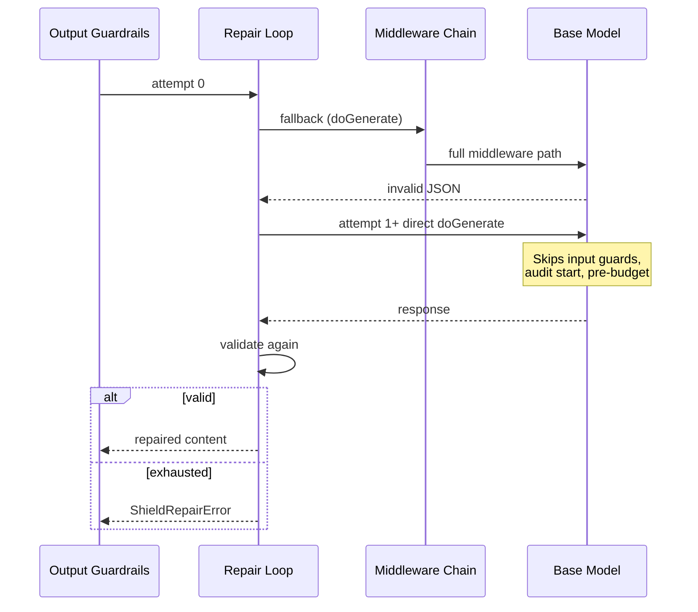
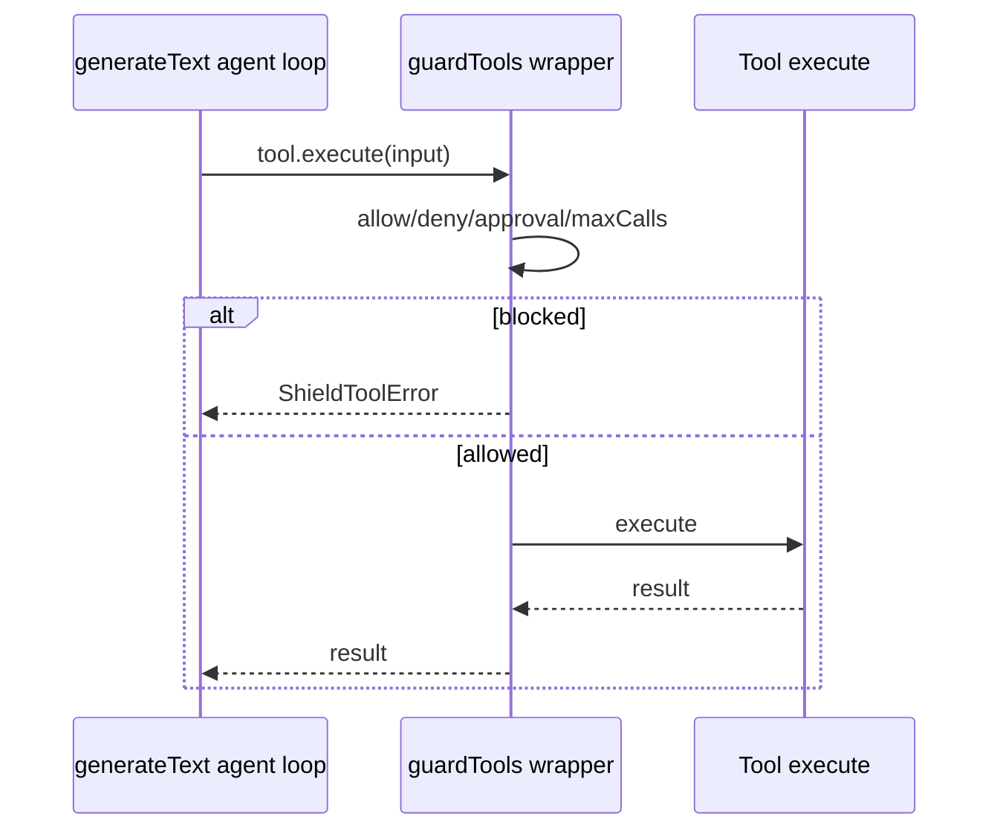

# Request Lifecycle

This document describes how a single request flows through ai-shield for the three main paths: synchronous generation, streaming, and structured output repair.

## Synchronous generation (`generateText`)

### Steps in detail

1. **Input phase** (`transformParams`): Extract prompt text, run guards. Block throws `ShieldBlockedError`. Redact modifies the prompt in place.
2. **Pre-call budget** (`wrapGenerate` in cost middleware): Estimate tokens from prompt, compute estimated cost, reject if session budget would be exceeded.
3. **Audit start**: Emit `request.start` with session/request IDs.
4. **Model call**: Output middleware delegates to repair middleware, which calls `doGenerate()` on the inner chain (first attempt).
5. **Repair** (if JSON/schema required): Validate output; retry with feedback prompt on failure (see [Repair retry path](#repair-retry-path)).
6. **Output guards**: Apply PII redaction and keyword checks to final text.
7. **Audit complete**: Emit `request.complete` with usage.
8. **Cost recording**: Update session store, emit `cost.recorded`, optionally `budget.warn`.

## Streaming (`streamText`)

Input guards still run via `transformParams` before the stream starts. The output path differs:

### Streaming implications

- **Latency**: The client does not receive tokens until the full stream is collected, repaired (if needed), and output-guarded. This trades real-time streaming for correctness.
- **Cost tracking**: Usage is recorded when the `finish` chunk is observed in the wrapped stream.
- **Audit**: `request.complete` fires after the stream is fully consumed.

## Structured output (`Output.object` + Zod)

When `responseFormat.type === 'json'` or `providerOptions.aiShield.outputSchema` is set, the repair loop activates:

1. First attempt goes through the full middleware chain (`fallback` → `doGenerate`).
2. Output is stripped of markdown fences, repaired syntactically, and validated against the Zod schema.
3. On failure, a user message is appended with validation feedback and optionally the previous invalid output.
4. Retries call `model.doGenerate()` **directly**, bypassing outer middleware.

See [Structured output](../features/structured-output.md) for configuration and security notes.

## Repair retry path

### What retries skip

On repair attempts after the first:

- Input guardrails (injection, PII, keywords)
- Pre-call budget assertion
- Audit `request.start` for the retry call

### What retries preserve

- Token usage from all attempts is merged into the final result
- Audit events: `repair.attempt`, `repair.success`, or `repair.failed`
- Output guards still run on the final text

## Tool execution (parallel path)

Tool calls happen inside AI SDK's agent loop, outside the model middleware chain:

Correlate tool audit events with model requests by passing the same `requestId` to both `providerOptions.aiShield` and `guardTools()`.

## Error propagation

| Error                | Thrown by           | When                                       |
| -------------------- | ------------------- | ------------------------------------------ |
| `ShieldBlockedError` | Input/output guards | Guard action is `block`                    |
| `ShieldBudgetError`  | Cost middleware     | Session budget exceeded (pre or post call) |
| `ShieldRepairError`  | Repair middleware   | All repair attempts exhausted              |
| `ShieldToolError`    | `guardTools`        | Tool policy violation                      |

Failed requests emit `request.blocked` audit events (from audit middleware or guard-specific paths).

## Related docs

- [Architecture overview](./overview.md)
- [Input guardrails](../features/input-guardrails.md)
- [Structured output](../features/structured-output.md)
- [Verification matrix](../testing/verification-matrix.md)
