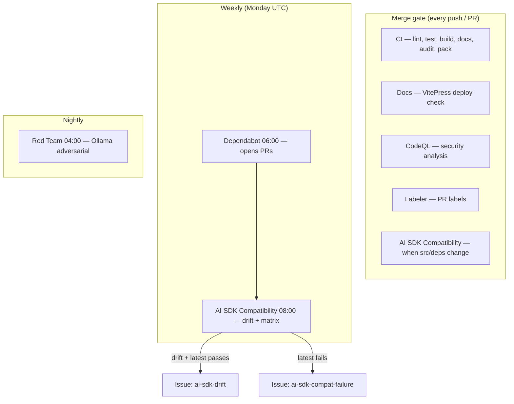

# CI and automation

This page is the **single map** of every automated pipeline in the ai-shield repository. Human contributors and Cursor agents should start here when asking “what runs when?” or “why did this workflow fail?”.

Related deep-dives:

- [Dependency policy](./dependency-policy.md) — Vercel AI SDK (`ai`) version strategy, Dependabot, drift handling
- [Running tests](../testing/running-tests.md) — local commands, test layout, env vars
- [Verification matrix](../testing/verification-matrix.md) — what each test layer proves

## Overview



## Workflow reference

| Workflow                 | File                                                             | Trigger                                           | Blocks merge?                | Purpose                                                  |
| ------------------------ | ---------------------------------------------------------------- | ------------------------------------------------- | ---------------------------- | -------------------------------------------------------- |
| **CI**                   | [`ci.yml`](../../.github/workflows/ci.yml)                       | Push / PR to `main`                               | **Yes**                      | Full quality gate + build + docs + `npm pack --dry-run`  |
| **AI SDK Compatibility** | [`ai-sdk-compat.yml`](../../.github/workflows/ai-sdk-compat.yml) | Weekly Mon 08:00 UTC, PR (deps/src/tests), manual | **Yes** on PR when triggered | Lockfile vs `ai@latest`; typecheck + test + build matrix |
| **Docs**                 | [`docs.yml`](../../.github/workflows/docs.yml)                   | Push / PR (docs paths)                            | **Yes** when triggered       | VitePress build / GitHub Pages                           |
| **CodeQL**               | [`codeql.yml`](../../.github/workflows/codeql.yml)               | Push / PR / schedule                              | Advisory                     | Static security analysis                                 |
| **Red Team**             | [`redteam.yml`](../../.github/workflows/redteam.yml)             | Daily 04:00 UTC, manual                           | **No** (`continue-on-error`) | Live Ollama injection prompts                            |
| **Labeler**              | [`labeler.yml`](../../.github/workflows/labeler.yml)             | PR opened / sync                                  | No                           | Auto-labels (`ci`, `tests`, `documentation`, …)          |

**Dependabot** ([`dependabot.yml`](../../.github/dependabot.yml)) is not a workflow but opens PRs weekly (Monday 06:00 UTC). The `ai-sdk` group bundles `ai` and `@ai-sdk/*`; those PRs should pass **CI** and **AI SDK Compatibility**.

## CI (merge gate)

**File:** `.github/workflows/ci.yml`  
**Node:** 22  
**Concurrency:** one run per ref; PRs cancel in-progress runs.

| Step            | Command              | What it proves                                               |
| --------------- | -------------------- | ------------------------------------------------------------ |
| Install         | `npm ci`             | Reproducible lockfile                                        |
| Quality gate    | `npm run ci`         | Lint (0 warnings), Prettier, `tsc`, Vitest, prod `npm audit` |
| Library         | `npm run build`      | `dist/` compiles via tsup                                    |
| Documentation   | `npm run docs:build` | VitePress links and MD valid                                 |
| Package tarball | `npm pack --dry-run` | npm publish surface = `dist` + README + LICENSE              |

`npm run ci` includes `tests/adversarial/` but **not** `tests/redteam/` (see [Running tests](../testing/running-tests.md)).

## AI SDK Compatibility

**File:** `.github/workflows/ai-sdk-compat.yml`  
**Why:** shieldkit is tightly coupled to [Vercel AI SDK v6](https://ai-sdk.dev/) (`LanguageModelV3` middleware). New `ai` releases can break types or middleware contracts before consumers upgrade.

### Jobs

| Job                      | What it does                                                                                                                                  |
| ------------------------ | --------------------------------------------------------------------------------------------------------------------------------------------- |
| **Version drift report** | Runs `scripts/check-ai-sdk-version.mjs`; writes a summary table (lockfile, npm latest, peer range, drift yes/no)                              |
| **Compatibility matrix** | Two parallel legs: **pinned lockfile** (`npm ci`) and **latest on npm** (`npm install ai@latest`); each runs `typecheck`, `test:run`, `build` |
| **Weekly notify**        | Scheduled only: opens a GitHub issue when drift is detected (latest passes) or when the matrix fails (latest breaks)                          |

### Outcomes (scheduled run)

| Situation                          | Workflow result                          | Maintainer action                                                                                          |
| ---------------------------------- | ---------------------------------------- | ---------------------------------------------------------------------------------------------------------- |
| Lockfile = latest, all green       | Pass                                     | None                                                                                                       |
| Lockfile &lt; latest, matrix green | Pass + optional `ai-sdk-drift` issue     | Merge Dependabot PR or `npm install ai@latest --save-dev`                                                  |
| `ai@latest` matrix red             | **Fail** + `ai-sdk-compat-failure` issue | Fix forward compatibility in `src/` / tests; read AI SDK [releases](https://github.com/vercel/ai/releases) |
| Pinned matrix red                  | **Fail**                                 | Fix regression on current pin (same as broken `main`)                                                      |

### PR triggers

Runs when a PR touches:

- `package.json`, `package-lock.json`
- `src/**`, `tests/**`
- `scripts/check-ai-sdk-version.mjs`, workflow or Dependabot config

### Local equivalents

```bash
npm run check:ai-sdk                    # drift report (human-readable)
npm run check:ai-sdk -- --strict        # exit 1 if lockfile < latest
npm run check:ai-sdk -- --json          # machine-readable
npm run verify:ai-sdk-latest            # full typecheck + test + build on latest
```

After `verify:ai-sdk-latest`, run `npm ci` to restore the lockfile pin.

Full policy: [Dependency policy](./dependency-policy.md).

## Red Team (advisory)

**File:** `.github/workflows/redteam.yml`  
**Schedule:** daily 04:00 UTC  
**Merge impact:** none (`continue-on-error: true`, `REDTEAM_STRICT=0`)

Installs Ollama on the runner, pulls `llama3.2`, runs `npm run test:redteam`. Uploads `test-results/` artifacts when present.

Locally, default `REDTEAM_STRICT=1` hard-fails on unblockable injection prompts. See [Security assurance report](../testing/SECURITY_ASSURANCE_REPORT.md).

## Docs deployment

**File:** `.github/workflows/docs.yml`  
Builds VitePress with `VITEPRESS_BASE` set for GitHub Pages project sites. Details: [DEPLOYMENT.md](../DEPLOYMENT.md).

## CodeQL

**File:** `.github/workflows/codeql.yml`  
JavaScript/TypeScript analysis on `src/`. Results appear in the GitHub Security tab.

## Dependabot groups

| Group                    | Packages                  | Schedule             |
| ------------------------ | ------------------------- | -------------------- |
| `ai-sdk`                 | `ai`, `@ai-sdk/*`         | Weekly Mon 06:00 UTC |
| `testing`                | vitest                    | Weekly               |
| `typescript-and-build`   | typescript, tsup, esbuild | Weekly               |
| `linting-and-formatting` | eslint, prettier          | Weekly               |
| `docs`                   | vitepress                 | Weekly               |
| `security-updates`       | any (security advisories) | As needed            |

## Labels (automation)

| Label                   | Source                           | Meaning                               |
| ----------------------- | -------------------------------- | ------------------------------------- |
| `dependencies`          | Dependabot / drift issues        | Dependency change                     |
| `ai-sdk-drift`          | AI SDK Compatibility (scheduled) | Latest passes; lockfile can be bumped |
| `ai-sdk-compat-failure` | AI SDK Compatibility (scheduled) | Latest `ai` breaks the test matrix    |
| `automated`             | Drift / compat issues            | Bot-opened reminder                   |

PR labels from [labeler.yml](../../.github/labeler.yml): `ci`, `dependencies`, `documentation`, `code`, `tests`, `examples`, `security`.

## Maintainer checklist

**Every PR**

- [ ] CI green
- [ ] AI SDK Compatibility green (if workflow ran on the PR)

**After merging an `ai` bump**

- [ ] `npm run ci` locally
- [ ] Scan [AI SDK changelog](https://github.com/vercel/ai/releases)
- [ ] Update `CHANGELOG.md` if peer or middleware behavior changed

**Weekly (optional)**

- Review Actions → _AI SDK Compatibility_ summary
- Triage open `ai-sdk-drift` / `ai-sdk-compat-failure` issues
- Merge grouped Dependabot PRs when green

## Related

- [Contributing](../contributing.md)
- [Dependency policy](./dependency-policy.md)
- [Cursor Agent Skills](./cursor-skills.md)
