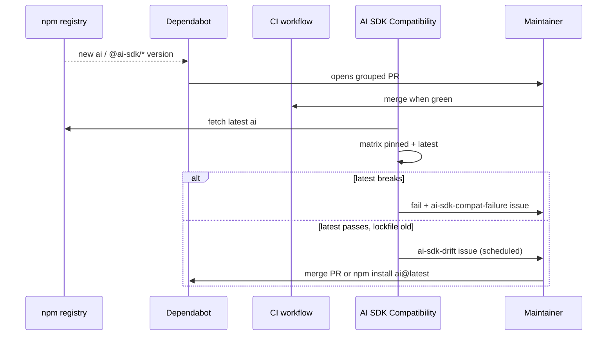

# Dependency policy

shieldkit is a **middleware library** on top of the [Vercel AI SDK](https://ai-sdk.dev/). The `ai` package is a **peer dependency** — consumers install it; we pin a devDependency for local development and CI.

**See also:** [CI and automation](./ci-and-automation.md) — full workflow map, schedules, and issue labels.

## AI SDK version strategy

| Concern                 | Policy                                                                          |
| ----------------------- | ------------------------------------------------------------------------------- |
| **Supported runtime**   | AI SDK **v6** (`LanguageModelV3`, `wrapLanguageModel`, `extractJsonMiddleware`) |
| **Peer range**          | `ai >= 6.0.0` in `package.json`                                                 |
| **Development pin**     | `ai` in `devDependencies` + `package-lock.json`                                 |
| **Transitive provider** | `@ai-sdk/provider` (types for middleware; resolved via `ai`)                    |
| **Updates**             | [Dependabot](../../.github/dependabot.yml) weekly (`ai-sdk` group)              |
| **Verification**        | [AI SDK Compatibility](../../.github/workflows/ai-sdk-compat.yml) workflow      |

v5 is **not** supported: types and middleware APIs differ (`LanguageModelV2` vs `LanguageModelV3`). A compatibility run with `ai@5` fails typecheck by design.

## How the pieces fit together



## Automation

### Dependabot (proactive PRs)

Every **Monday 06:00 UTC**, Dependabot opens grouped PRs for `ai` and `@ai-sdk/*`.

- Label: `dependencies`
- Commit prefix: `deps`
- **Merge when:** CI and AI SDK Compatibility are green

### AI SDK Compatibility (verification)

Every **Monday 08:00 UTC** (after Dependabot), plus PRs that touch dependencies or `src/` / `tests/`.

| Job                  | Purpose                                                                                           |
| -------------------- | ------------------------------------------------------------------------------------------------- |
| Version drift report | Compare lockfile pin vs [npm latest](https://www.npmjs.com/package/ai); table in workflow summary |
| Matrix: pinned       | `npm ci` → typecheck, test, build                                                                 |
| Matrix: latest       | `npm install ai@latest` → typecheck, test, build                                                  |
| Weekly notify        | Opens issues — see [outcomes](./ci-and-automation.md#outcomes-scheduled-run)                      |

**Manual run:** GitHub → Actions → _AI SDK Compatibility_ → _Run workflow_.

### What we do _not_ automate

- Publishing to npm (`npm publish` — maintainer credentials)
- Bumping `shieldkit` semver on every `ai` patch (only when we cut a library release)
- Frontier API live tests (no keys in CI)

## Local commands

```bash
# Human-readable drift report (lockfile, latest, peer range, @ai-sdk/provider pin)
npm run check:ai-sdk

# JSON for scripts
npm run check:ai-sdk -- --json

# Exit 1 when lockfile < latest (use in custom scripts)
npm run check:ai-sdk -- --strict

# Full verification on ai@latest (mutates node_modules — run npm ci after)
npm run verify:ai-sdk-latest
```

Example output:

```
ai locked:           6.0.207
ai latest:           6.0.210
@ai-sdk/provider:    3.0.10
declared:            ^6.0.207
peer range:          >=6.0.0
```

## When a new `ai` version ships

1. Read the [AI SDK changelog](https://github.com/vercel/ai/releases) and [provider breaking changes](https://github.com/vercel/ai/tree/main/packages/provider).
2. Wait for Dependabot PR **or** run `npm install --save-dev ai@latest`.
3. Run `npm run ci` and `npm run verify:ai-sdk-latest` if you want to double-check.
4. If middleware or provider types changed, update `src/` and `tests/unit/`.
5. Update `docs/testing/verification-matrix.md` if behavior changed.
6. Note user-facing shifts in `CHANGELOG.md` under `[Unreleased]`.

## Peer dependency contract

Consumers must install compatible peers:

```bash
npm install shieldkit ai zod
```

| Package | Range                 | Notes                            |
| ------- | --------------------- | -------------------------------- |
| `ai`    | `>= 6.0.0`            | Required — middleware targets v6 |
| `zod`   | `^3.25.0 \|\| ^4.0.0` | Structured output repair         |

We develop against the **lockfile pin**; CI proves that pin and **npm latest** both work.

## Other dependencies

Non–AI-SDK updates use separate Dependabot groups (`testing`, `typescript-and-build`, etc.). Security advisories are not grouped — Dependabot opens them immediately.

## Related

- [CI and automation](./ci-and-automation.md)
- [Contributing](../contributing.md)
- [Running tests](../testing/running-tests.md)
